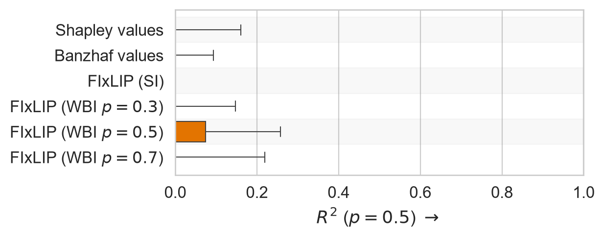
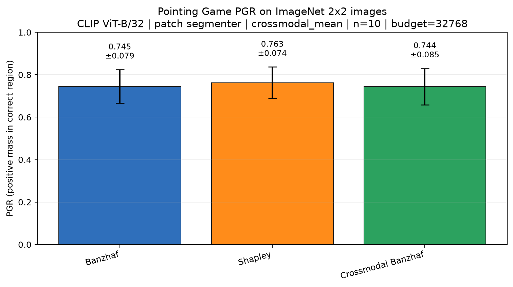
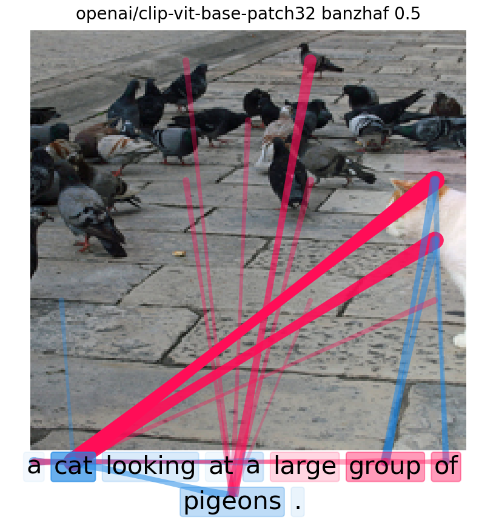
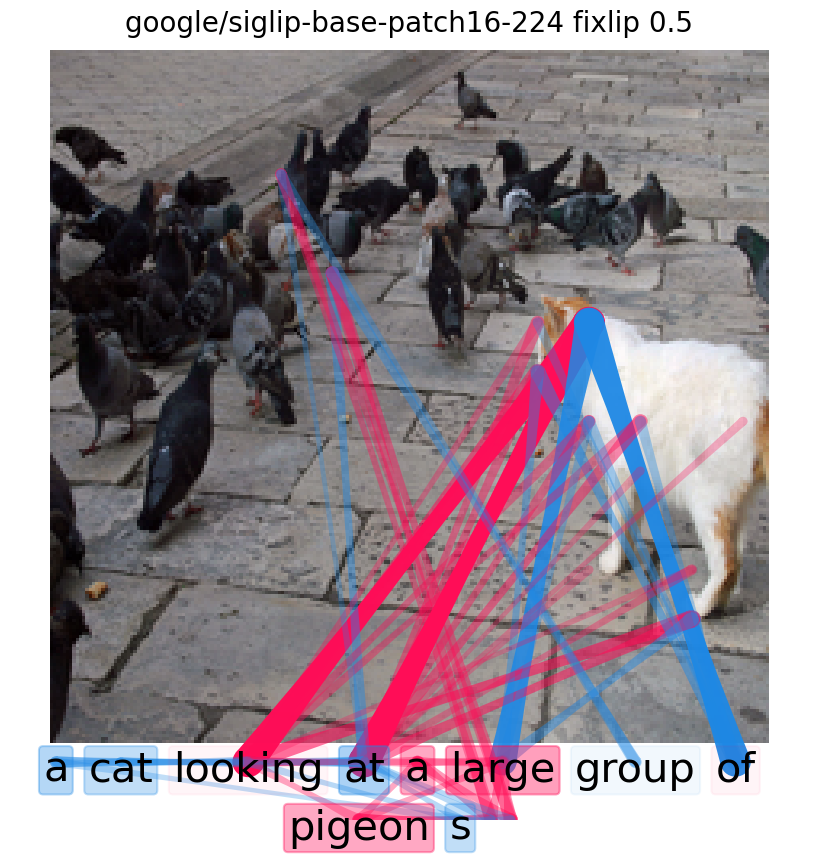
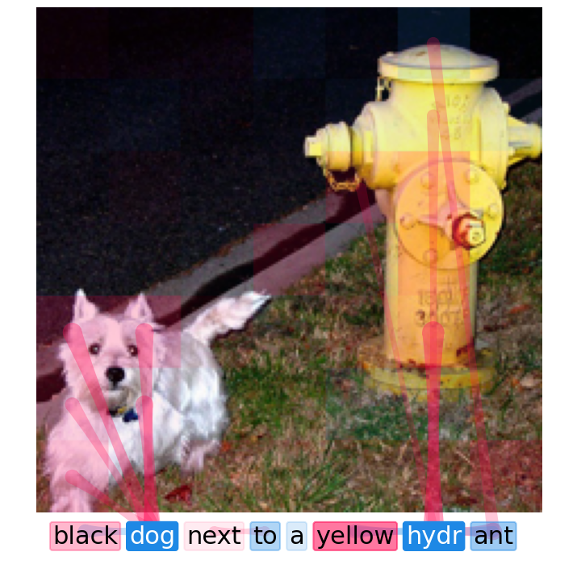
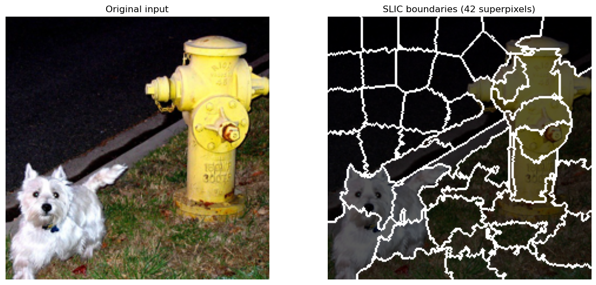
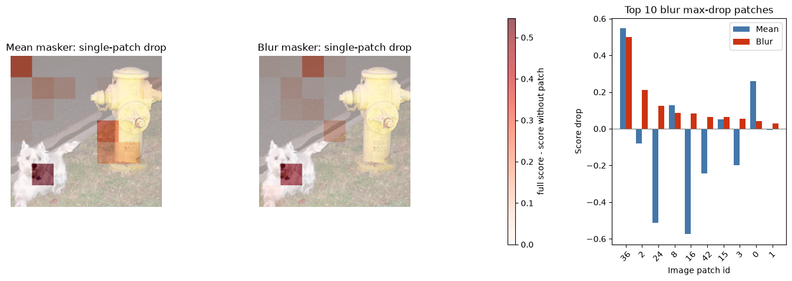

# Pluggable Image Imputer for shapiq — Demo

Modular vision-language model explanation pipeline built on **shapiq** + **fixlip**.
Pluggable Segmenters (patch, SLIC, gradient-guided) × Maskers (mean, blur, attention)
→ Shapley-interaction explanations for CLIP / SigLIP.

## Environment Setup

### conda

```bash
conda env create -f environment.yml
conda activate shapiq_demo
```

This creates a self-contained environment with all dependencies (PyTorch 2.4.1 + CUDA 11.8,
Transformers 4.51.3, modular shapiq, scikit-image, etc.).

> **Note on reproducibility**: The conda-forge binary of PyTorch differs from the PyPI wheel
> (different cuDNN versions, C++ ABI, and CUDA library bundles).  If you observe tiny
> floating-point differences between runs in different environments, this is expected —
> see the Reproducibility Note below.

---

## Quick Start

```python
from shapiq.imputer.vision import VisionImputerFactory, VisionLanguageGame

factory = VisionImputerFactory()
imputer = factory.build(model, processor, image, text)          # defaults: Patch + CrossModalMean
# imputer = factory.build(model, processor, image, text,
#                         segmenter_config=SegmenterConfig(strategy="slic"),
#                         masker_config=MaskerConfig(strategy="vision_blur"))
game = VisionLanguageGame(imputer, batch_size=64)
# game is now usable with any shapiq approximator (KernelSHAP, SVARM-I, etc.)
```

See notebooks below for end-to-end examples.

---

## Experiment Results

### 1. Faithfulness

How well do Shapley-interaction explanations predict the model's output under coalition
occlusion?

| Script | `experiments/migrated/faithfulness.py` |
|---|---|
| Models | CLIP ViT-B/32, ViT-B/16, ViT-L/14; SigLIP |

| Model | Segmenter | Masker | Pearson r | Spearman ρ | MSE |
|---|---:|---:|---:|---:|---:|
| CLIP ViT-B/32 | patch | crossmodal_mean | — | — | — |



---

### 2. Insertion / Deletion (AID)

Area under the insertion/deletion curve — higher is better.

| Script | `experiments/migrated/insertion_deletion.py` (CLIP) / `*_siglip.py` |
|---|---|

| Model | Segmenter | Masker | AID ↑ | Insertion ↑ | Deletion ↓ |
|---|---:|---:|---:|---:|---:|
| CLIP ViT-B/32 | patch | crossmodal_mean | — | — | — |


#### SigLIP

| Model | Segmenter | Masker | AID ↑ |
|---|---:|---:|--|
| SigLIP base-patch16 | patch | crossmodal_mean | — |


---

### 3. Pointing Game

Positive Gradient Removal (PGR) accuracy — does the explanation correctly identify the
image region most responsible for the prediction?

| Scripts | `experiments/migrated/pointing_game_banzhaf.py`, `*_shapley.py`, `*_crossmodal.py` |
|---|---|

#### Banzhaf Interactions

| Model | Segmenter | PGR ↑ |
|---|---:|---:|
| CLIP ViT-B/32 | patch | — |

#### Shapley Interactions

| Model | Segmenter | PGR ↑ |
|---|---:|---:|
| CLIP ViT-B/32 | patch | — |

#### Crossmodal (Banzhaf)

| Model | Segmenter | PGR ↑ |
|---|---:|---:|
| CLIP ViT-B/32 | patch | — |



---

### 4. Qualitative Examples (MSCOCO)

Example Shapley-interaction explanations on real images.

| Script | `experiments/migrated/explain_mscoco.py` (CLIP) / `*_siglip.py` |
|---|---|



#### SigLIP



---

### Reproducibility Note

`example_siglip_updated.ipynb` interaction values are sensitive to the
PyTorch build.  `conda-forge` and `pip` distribute different binaries of
the same version (`2.4.1`) — they differ in compilation flags, BLAS/LAPACK
backends, and cuDNN bindings.  These produce tiny floating-point
differences in model forward passes (< 1e-6 per coalition), which
**XGBoost proxyshap** amplifies through tree-split decisions.

→ Always use the conda environment above to reproduce the reported numbers.

---

## Notebooks

### `example.ipynb`
CLIP ViT-B/32 + PatchSegmenter + CrossModalMeanMasker — full pipeline.



### `example_slic.ipynb`

**SLICSegmenter — CLIP-ResNet validation.** ViT CLIP uses a rigid square patch grid,
but CNN backbones (CLIP-ResNet) do not. For these, the image is split into SLIC
superpixels and each superpixel becomes one image player. This notebook validates that
`VisionImputerFactory` auto-detects the CNN backbone and routes it to the SLIC segmenter.

| Setting | Value |
|---|---|
| Model | CLIP ResNet-50 (`openai/clip-rn50`, via OpenAI-CLIP adapter) |
| Image / text | `assets/dog_and_hydrant.png` / "black dog next to a yellow hydrant" |
| Segmenter | `slic`, `SlicParams(n_segments=64)` → 42 superpixels |
| Masker | `crossmodal_mean` (default) |

```python
from shapiq.imputer.vision import VisionImputerFactory, SegmenterConfig, SlicParams

factory = VisionImputerFactory()
seg_cfg = SegmenterConfig(strategy="slic", slic=SlicParams(n_segments=64))
imputer = factory.build(model, processor, image, text, segmenter_config=seg_cfg)
# imputer.layout.patch_size == 0  → CNN path; image players are SLIC superpixels
```

**Validation result.** The factory detects the model as `clip` with `patch_size == 0`,
builds a SLIC layout, keeps the label map on CPU and scatters masks to the model device
without crashing, and runs the full FIxLIP/AID pipeline.

| Model | n superpixels | Empty | Full | AID ↑ | Peak mem |
|---|---:|---:|---:|---:|---:|
| CLIP ResNet-50 | 42 | 15.5 | 29.77 | 0.612 | 0.27 GB |

The notebook produces two figures: the SLIC superpixel boundaries (showing the
content-adaptive, non-grid layout) and the full image+text Shapley-interaction
explanation mapped through the superpixel layout.



### `example_blur.ipynb`

**VisionBlurMasker — Gaussian-blur occlusion.** Compares two cross-modal occlusion
strategies on the same model: the default **mean** masker (multiplicative zero-out)
vs. the **blur** masker, which replaces masked regions with a Gaussian-blurred copy
(`skimage.filters.gaussian`, per channel on CPU) and blends
`output = original * mask + blurred * (1 - mask)`.

| Setting | Value |
|---|---|
| Model | CLIP ViT-B/32 (`openai/clip-vit-base-patch32`) |
| Image / text | `assets/dog_and_hydrant.png` / "black dog next to a yellow hydrant" |
| Segmenter | patch (49 image players + 8 text players) |
| Maskers compared | `crossmodal_mean` vs `crossmodal_blur`, `VisionBlurParams(sigma=3.0)` |
| Approximator | FIxLIP, Banzhaf, max_order=2, budget `2**18` |

```python
from shapiq.imputer.vision import (
    VisionImputerFactory, MaskerConfig, VisionBlurParams,
)

factory = VisionImputerFactory()
masker_cfg = MaskerConfig(
    strategy="crossmodal_blur",                 # composite, NOT image-only "vision_blur"
    vision_blur=VisionBlurParams(sigma=3.0),
)
imputer = factory.build(model, processor, image, text, masker_config=masker_cfg)
```

> **Use `crossmodal_blur`, not `vision_blur`, for cross-modal games.** `vision_blur`
> only touches `pixel_values` and leaves the text un-masked, yielding meaningless text
> attributions. `crossmodal_blur` pairs Gaussian image blur with text-attention masking,
> so it differs from the mean baseline *only* on the image side — a fair comparison.

**Results.** Both maskers agree on the single most important patch (#36), but blur is a
softer perturbation: removing one patch drops the score less than zero-out does.

| Masker | Empty | Full | Max single-patch drop | Top patch | Compute time |
|---|---:|---:|---:|---:|---:|
| `crossmodal_mean` | 22.87 | 33.95 | 0.5466 | 36 | 18.1 s |
| `crossmodal_blur` (σ=3.0) | 21.52 | 33.95 | 0.4997 | 36 | 31.4 s |

Blur costs ~1.7× more compute (CPU Gaussian convolution per coalition). The image-player
attributions of the two maskers are strongly correlated (see scatter panel in the
notebook), confirming blur is a drop-in alternative that yields consistent explanations
with gentler edits.



### `example_gradient_guided.ipynb`
GradientGuidedSegmenter — saliency-guided non-uniform layout.

### `example_siglip_updated.ipynb`
SigLIP model support — see Reproducibility Note above.

### `example_faster.ipynb`
Batch-size tuning and performance profiling.

### `attention_masker_demo.ipynb`
AttentionMasker — self-attention -inf injection.

### `insertion_deletion.ipynb`
AID curve computation and plotting.

---

## Adding Results

1. Run the experiment script, save the output figure to `data/report_pictures/`.
2. Update the relevant section above with numeric metrics or the image.
3. Add the image using:
   ```markdown
   
   ```
