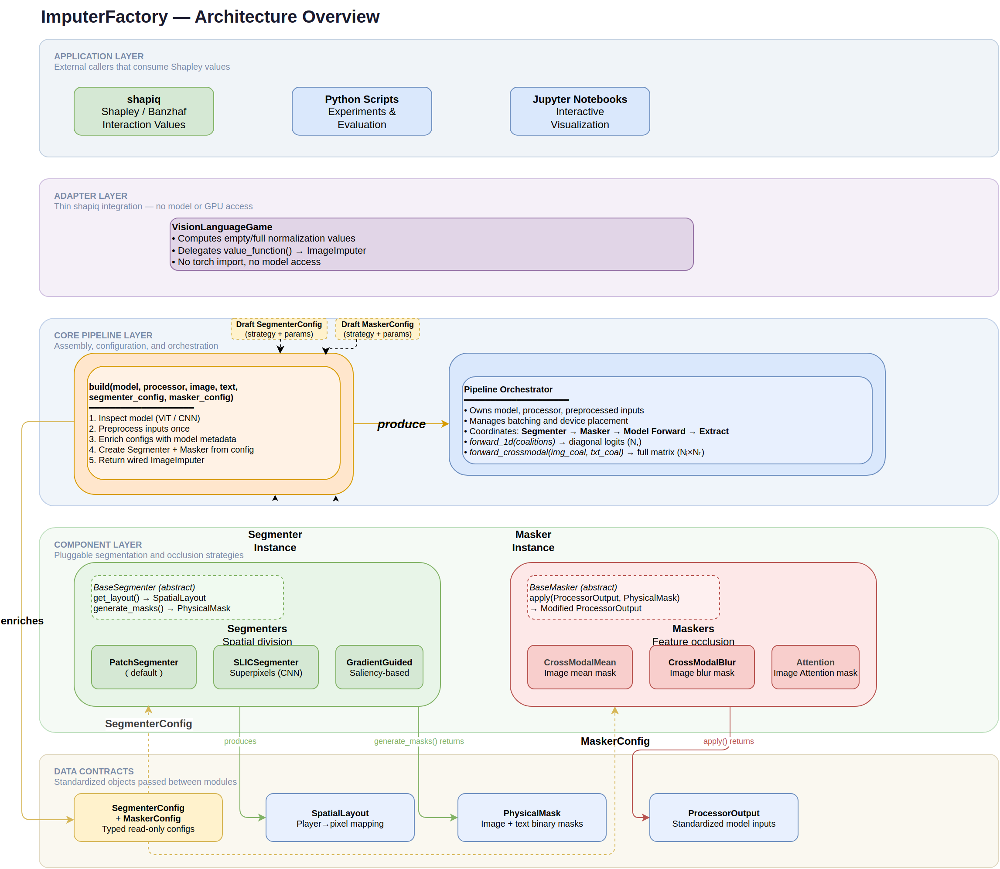
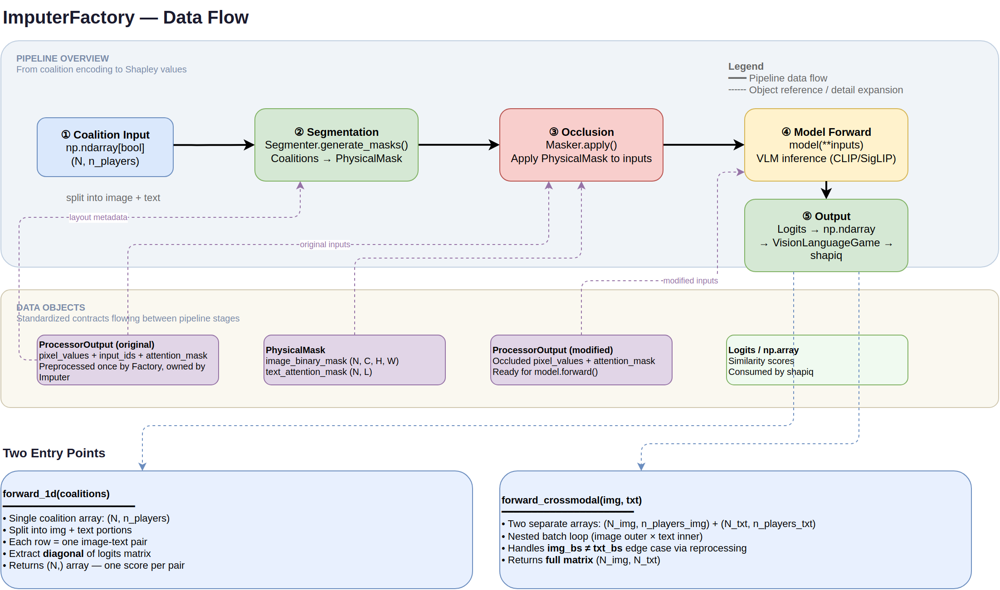
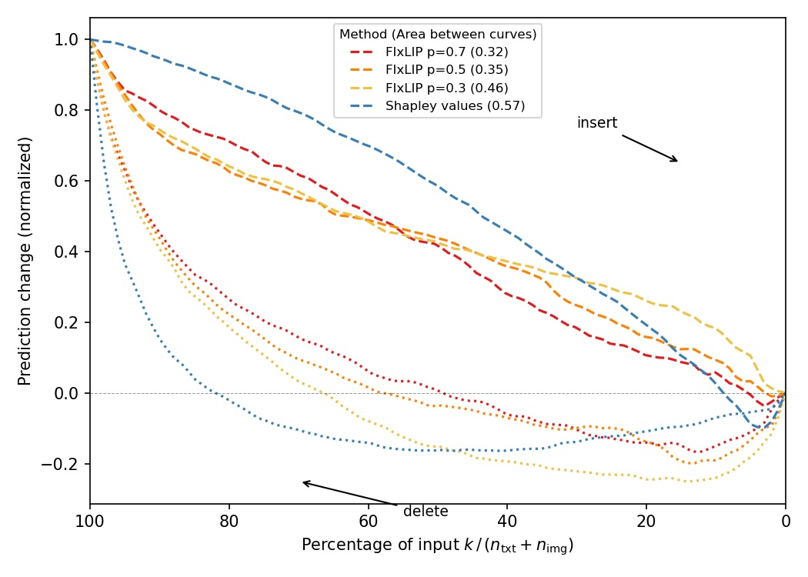
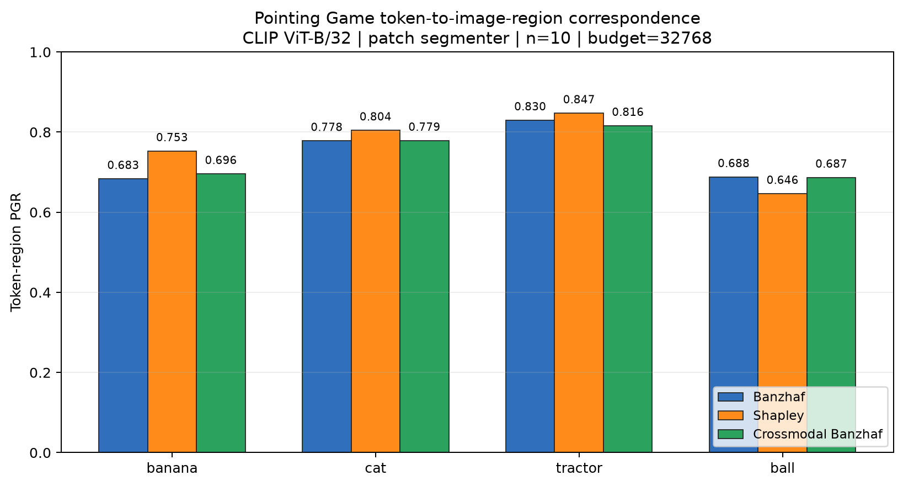
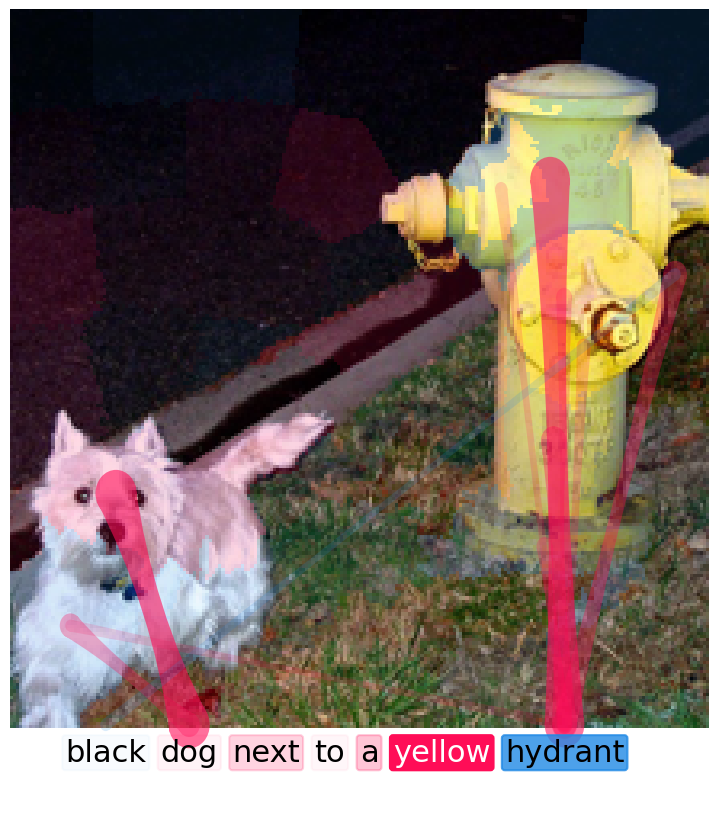
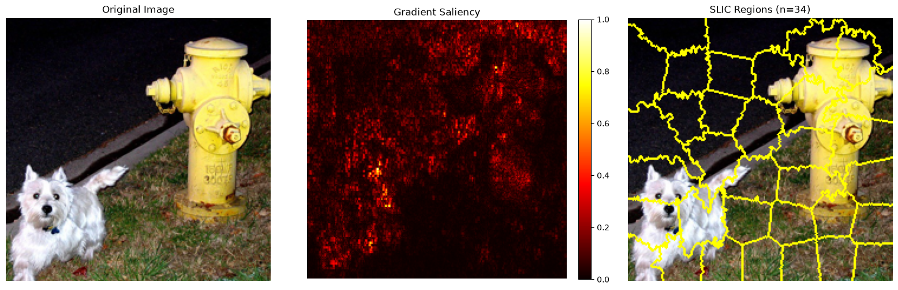
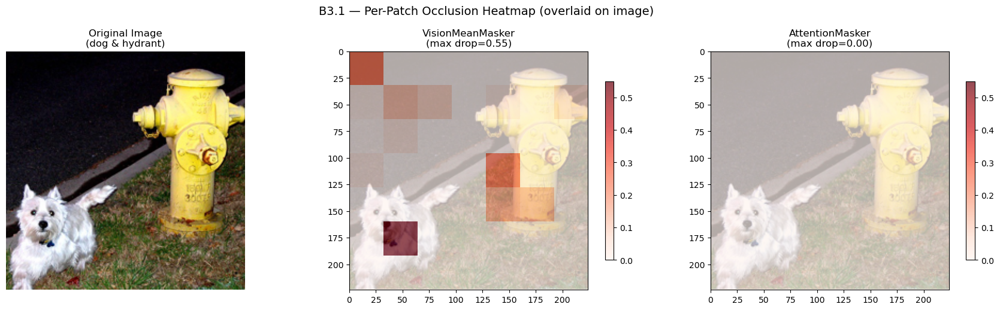
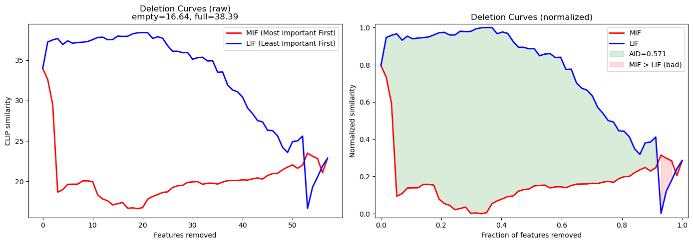
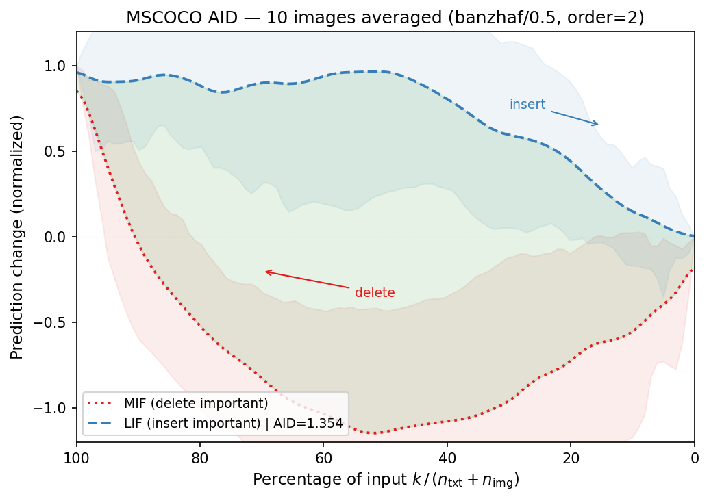

# Pluggable Image Imputer for shapiq — Demo

Modular vision-language model explanation pipeline built on **shapiq** + **fixlip**.
Pluggable Segmenters (patch, SLIC, gradient-guided) × Maskers (mean, blur, attention)
→ Shapley-interaction explanations for CLIP / SigLIP.

## Overall Design

### Architecture



`VisionImputerFactory` auto-detects the model backbone (ViT vs. CNN), selects a matching
Segmenter, assembles a Masker chain, and wires them into a `VisionImputer` — the
orchestration engine that drives coalition masking and forward passes.

### Data Flow



From a single (image, text) pair through segment layout → mask generation → batched
coalition inference → similarity logits → shapiq Game → Shapley-interaction explanation.

## Environment Setup

### conda

```bash
conda env create -f environment.yml
conda activate shapiq_demo
```

This creates a self-contained environment with all dependencies (PyTorch 2.4.1 + CUDA 11.8,
Transformers 4.51.3, modular shapiq, scikit-image, etc.).

> **Note on reproducibility**: The conda-forge binary of PyTorch differs from the PyPI wheel
> (different cuDNN versions, C++ ABI, and CUDA library bundles).  If you observe tiny
> floating-point differences between runs in different environments, this is expected —
> see the Reproducibility Note below.

---

## Quick Start

```python
from shapiq.imputer.vision import VisionImputerFactory, VisionLanguageGame

factory = VisionImputerFactory()
imputer = factory.build(model, processor, image, text)          # defaults: Patch + CrossModalMean
# imputer = factory.build(model, processor, image, text,
#                         segmenter_config=SegmenterConfig(strategy="slic"),
#                         masker_config=MaskerConfig(strategy="vision_blur"))
game = VisionLanguageGame(imputer, batch_size=64)
# game is now usable with any shapiq approximator (KernelSHAP, SVARM-I, etc.)
```

See notebooks below for end-to-end examples.

---

## Experiment Results

### 1. Faithfulness

How well do Shapley-interaction explanations predict the model's output under coalition
occlusion?

| Script | `experiments/migrated/faithfulness.py` |
|---|---|
| Models | CLIP ViT-B/32, ViT-B/16, ViT-L/14; SigLIP |

| Model | Segmenter | Masker | Pearson r | Spearman ρ | MSE |
|---|---:|---:|---:|---:|---:|
| CLIP ViT-B/32 | patch | crossmodal_mean | — | — | — |


---

### 2. Insertion / Deletion (AID)

Area under the insertion/deletion curve — higher is better.

| Script | `experiments/migrated/insertion_deletion.py` (CLIP) / `*_siglip.py` |
|---|---|
<!-- 
| Model | Segmenter | Masker | AID ↑ | Insertion ↑ | Deletion ↓ |
|---|---:|---:|---:|---:|---:|
| CLIP ViT-B/32 | patch | crossmodal_mean | 1.431 | 0.920 | −0.510 | -->

AID ↑ (area between the insertion and deletion curves; higher is better).

| Model | Segmenter | Masker | Shapley | FIxLIP p=0.3 | FIxLIP p=0.5 | FIxLIP p=0.7 |
|---|---:|---:|---:|---:|---:|---:|
| CLIP ViT-B/32 | patch | crossmodal_mean | 0.57 | 0.46 | 0.35 | 0.32 |



> _Run Specification: budget 2048, batch size 64, 100 images._

<!-- #### SigLIP

| Model | Segmenter | Masker | AID ↑ |
|---|---:|---:|--|
| SigLIP base-patch16 | patch | crossmodal_mean | — |

 -->

---

### 3. Pointing Game

Positive Gradient Removal (PGR) accuracy — does the explanation correctly identify the
image region most responsible for the prediction?
Token-level PGR breaks this down by the four class tokens and their corresponding image regions.

| Scripts | `experiments/migrated/pointing_game_banzhaf.py`, `*_shapley.py`, `*_crossmodal.py` |
|---|---|

#### Banzhaf Interactions

| Model | Segmenter | PGR ↑ | banana | cat | tractor | ball |
|---|---|---:|---:|---:|---:|---:|
| CLIP ViT-B/32 | patch | 0.745 ± 0.079 | 0.683 | 0.778 | 0.830 | 0.688 |

#### Shapley Interactions

| Model | Segmenter | PGR ↑ | banana | cat | tractor | ball |
|---|---|---:|---:|---:|---:|---:|
| CLIP ViT-B/32 | patch | 0.763 ± 0.074 | 0.753 | 0.804 | 0.847 | 0.646 |

#### Crossmodal (Banzhaf)

| Model | Segmenter | PGR ↑ | banana | cat | tractor | ball |
|---|---|---:|---:|---:|---:|---:|
| CLIP ViT-B/32 | patch | 0.744 ± 0.085 | 0.696 | 0.779 | 0.816 | 0.687 |




---

### 4. Qualitative Examples (MSCOCO)

Example Shapley-interaction explanations on real images.

| Script | `experiments/migrated/explain_mscoco.py` (CLIP) / `*_siglip.py` |
|---|---|

<table>
<tr>
  <td align="center"><b>CLIP ViT-B/32</b></td>
  <td align="center"><b>SigLIP base-patch16</b></td>
</tr>
<tr>
  <td></td>
  <td></td>
</tr>
</table>

---

### Reproducibility Note

`example_siglip_updated.ipynb` interaction values are sensitive to the
PyTorch build.  `conda-forge` and `pip` distribute different binaries of
the same version (`2.4.1`) — they differ in compilation flags, BLAS/LAPACK
backends, and cuDNN bindings.  These produce tiny floating-point
differences in model forward passes (< 1e-6 per coalition), which
**XGBoost proxyshap** amplifies through tree-split decisions.

→ Always use the conda environment above to reproduce the reported numbers.

---

## Notebooks

### `example.ipynb`
CLIP ViT-B/32 + PatchSegmenter + CrossModalMeanMasker — full pipeline.


### `example_slic.ipynb`

**SLICSegmenter — CLIP-ResNet validation.** ViT CLIP uses a rigid square patch grid,
but CNN backbones (CLIP-ResNet) do not. For these, the image is split into SLIC
superpixels and each superpixel becomes one image player. This notebook validates that
`VisionImputerFactory` auto-detects the CNN backbone and routes it to the SLIC segmenter.

| Setting | Value |
|---|---|
| Model | CLIP ResNet-50 (`openai/clip-rn50`, via OpenAI-CLIP adapter) |
| Image / text | `assets/dog_and_hydrant.png` / "black dog next to a yellow hydrant" |
| Segmenter | `slic`, `SlicParams(n_segments=64)` → 42 superpixels |
| Masker | `crossmodal_mean` (default) |

```python
from shapiq.imputer.vision import VisionImputerFactory, SegmenterConfig, SlicParams

factory = VisionImputerFactory()
seg_cfg = SegmenterConfig(strategy="slic", slic=SlicParams(n_segments=64))
imputer = factory.build(model, processor, image, text, segmenter_config=seg_cfg)
# imputer.layout.patch_size == 0  → CNN path; image players are SLIC superpixels
```

**Validation result.** The factory detects the model as `clip` with `patch_size == 0`,
builds a SLIC layout, keeps the label map on CPU and scatters masks to the model device
without crashing, and runs the full FIxLIP/AID pipeline.

| Model | n superpixels | Empty | Full | AID ↑ | Peak mem |
|---|---:|---:|---:|---:|---:|
| CLIP ResNet-50 | 42 | 15.5 | 29.77 | 0.612 | 0.27 GB |

The notebook produces two figures. First, the SLIC superpixel boundaries, showing the
content-adaptive, non-grid layout used as image players:


Second, the full image+text Shapley-interaction explanation mapped through the
superpixel layout:



### `example_blur.ipynb`

**VisionBlurMasker — Gaussian-blur occlusion.** Compares two cross-modal occlusion
strategies on the same model: the default **mean** masker (multiplicative zero-out)
vs. the **blur** masker, which replaces masked regions with a Gaussian-blurred copy
(`skimage.filters.gaussian`, per channel on CPU) and blends
`output = original * mask + blurred * (1 - mask)`.

| Setting | Value |
|---|---|
| Model | CLIP ViT-B/32 (`openai/clip-vit-base-patch32`) |
| Image / text | `assets/dog_and_hydrant.png` / "black dog next to a yellow hydrant" |
| Segmenter | patch (49 image players + 8 text players) |
| Maskers compared | `crossmodal_mean` vs `crossmodal_blur`, `VisionBlurParams(sigma=3.0)` |
| Approximator | FIxLIP, Banzhaf, max_order=2, budget `2**18` |

```python
from shapiq.imputer.vision import (
    VisionImputerFactory, MaskerConfig, VisionBlurParams,
)

factory = VisionImputerFactory()
masker_cfg = MaskerConfig(
    strategy="crossmodal_blur",                 # composite, NOT image-only "vision_blur"
    vision_blur=VisionBlurParams(sigma=3.0),
)
imputer = factory.build(model, processor, image, text, masker_config=masker_cfg)
```

> **Use `crossmodal_blur`, not `vision_blur`, for cross-modal games.** `vision_blur`
> only touches `pixel_values` and leaves the text un-masked, yielding meaningless text
> attributions. `crossmodal_blur` pairs Gaussian image blur with text-attention masking,
> so it differs from the mean baseline *only* on the image side — a fair comparison.

**Results.** Both maskers agree on the single most important patch (#36), but blur is a
softer perturbation: removing one patch drops the score less than zero-out does.

| Masker | Empty | Full | Max single-patch drop | Top patch | Compute time |
|---|---:|---:|---:|---:|---:|
| `crossmodal_mean` | 22.87 | 33.95 | 0.5466 | 36 | 18.1 s |
| `crossmodal_blur` (σ=3.0) | 21.52 | 33.95 | 0.4997 | 36 | 31.4 s |

Blur costs ~1.7× more compute (CPU Gaussian convolution per coalition). The image-player
attributions of the two maskers are strongly correlated (see scatter panel in the
notebook), confirming blur is a drop-in alternative that yields consistent explanations
with gentler edits.


### `example_gradient_guided.ipynb`

**GradientGuidedSegmenter — saliency-guided non-uniform superpixel layout.**

Instead of a rigid 7×7 patch grid, GradientGuidedSegmenter uses CLIP pixel gradients
to build a saliency map, then clusters superpixels via SLIC on that map — high-saliency
regions get finer segmentation, background gets coarser. This notebook validates the
pipeline on a CNN backbone (CLIP ResNet-50) where pixel gradients carry genuine spatial
variation.

| Setting | Value |
|---|---|
| Model | CLIP ResNet-50 (`openai/clip-rn50`, via OpenAI-CLIP adapter) |
| Image / text | `assets/dog_and_hydrant.png` / "black dog next to a yellow hydrant" |
| Segmenter | `gradient_guided` → saliency from `\|grad\|.mean(channels)` → SLIC |
| Masker | `crossmodal_mean` (default) |

```python
from shapiq.imputer.vision import VisionImputerFactory, SegmenterConfig
from shapiq.imputer.vision import VisionLanguageGame

factory = VisionImputerFactory()
imputer = factory.build(
    model, processor, image, text,
    segmenter_config=SegmenterConfig(strategy="gradient_guided"),
)
game = VisionLanguageGame(imputer, batch_size=64)
# n_players_image=34 (SLIC superpixels) vs 49 (rigid patch grid)
```

**Algorithm.** Forward pass + `backward()` on image-text similarity → per-pixel
gradient `\|grad\|.mean(channels)` → saliency map → `skimage.segmentation.slic()`
on saliency → region labels → `coalitions[:, region_map]` → image masks.

**Validation result.** The gradient-guided pipeline passes forward+backward and SLIC
region building without errors. The saliency map reflects image regions that matter for
the text prompt; SLIC clusters these into content-adaptive superpixels. FIxLIP runs to
completion on the 42-player game.

| Model | n image players | n text players | Baseline | Budget | Top singleton |
|---:|---:|---:|---:|---:|---:|
| CLIP ResNet-50 | 34 | 8 | 1.28 | 2¹⁸ | 3.10 (player 39) |

The notebook produces three diagnostic panels: original image, gradient saliency map
(heatmap), and SLIC region boundaries overlaid on the image — plus the full image+text
Shapley-interaction explanation via `plot_slicimage_and_text_together`.



### `example_siglip_updated.ipynb`
SigLIP model support — see Reproducibility Note above.

### `example_faster.ipynb`
Batch-size tuning and performance profiling.

### `example_attention_masker.ipynb`

**AttentionMasker — self-attention -inf injection for latent-space occlusion.**

VisionMeanMasker zeroes out pixel regions before the encoder, so the model sees black
blocks — an out-of-distribution signal. AttentionMasker instead injects `-inf` into the
self-attention scores of the CLIP vision encoder's 12 transformer layers *before*
softmax, so masked patches cannot be attended to in latent space. This is closer to
true feature removal.

| Setting | Value |
|---|---|
| Model | CLIP ViT-B/32 (`openai/clip-vit-base-patch32`, `attn_implementation="eager"`) |
| Image / text | `assets/dog_and_hydrant.png` / "black dog next to a yellow hydrant" |
| Segmenter | patch (49 image players + 8 text players) |
| Maskers compared | `vision_mean` (baseline) vs `attention` |
| Extra | 4 MSCOCO images for multi-image validation |

```python
from shapiq.imputer.vision import VisionImputerFactory, MaskerConfig

# Two separate model instances with eager attention
model_mean = CLIPModel.from_pretrained("openai/clip-vit-base-patch32",
                                        attn_implementation="eager").to("cuda")
model_attn = CLIPModel.from_pretrained("openai/clip-vit-base-patch32",
                                        attn_implementation="eager").to("cuda")

factory = VisionImputerFactory()
imputer_attn = factory.build(model_attn, processor, image, text,
                              masker_config=MaskerConfig(strategy="attention"))
# Factory passes `model` → AttentionMasker._setup() → 12 pre-hooks registered
```

> **Use `attn_implementation="eager"`, not the default SDPA.** Flash Attention and
> `sdpa` skip custom `attention_mask` tensors injected via hooks. Eager attention
> applies the modified mask faithfully. Also, use **separate model instances** for
> each imputer — a single shared model causes hook contamination between maskers.

**Design.** `AttentionMasker._setup(model)` registers 12 forward pre-hooks — one per
ViT encoder layer — via `layer.self_attn.register_forward_pre_hook(hook_fn,
with_kwargs=True)`. At inference, `apply()` converts a pixel mask to per-patch means,
finds masked patch IDs, and builds a `(1, 1, 50, 50)` bias tensor with `-inf` at
those key positions. When `model.forward()` runs, each pre-hook adds the bias to
`causal_attention_mask` before softmax. After `exp(-inf) = 0`, masked patches receive
zero attention weight. **Only the KEY dimension is masked** — masking both key and
query causes `exp(all -inf) = 0/0 = NaN`, producing an all-white heatmap.

**Results.** Both maskers produce identical full-image logit similarity (33.95) —
no patches masked, no -inf injected. VisionMean produces meaningful per-patch
variation; AttentionMasker applies occlusion in latent self-attention rather than at
the pixel input, yielding a different occlusion pattern across the 7×7 grid.

The notebook produces a 3-panel per-patch occlusion heatmap (original + VisionMean +
Attention), plus a 2×3 summary grid across dog & hydrant + 4 MSCOCO images.



### `insertion_deletion.ipynb`

**AID evaluation pipeline — insertion/deletion curves + area-between-curves metric.**

End-to-end pipeline from FIxLIP approximation through MIF/LIF deletion curves to
paper-style AID visualization. Validates that the new `ImageImputerFactory` pipeline
is numerically equivalent to the old `src.game_huggingface` pipeline, then scales to
10 MSCOCO images with reusable `compute_aid_for_image()` function.

| Setting | Value |
|---|---|
| Model | CLIP ViT-B/32 (`openai/clip-vit-base-patch32`) |
| Image / text | `assets/dog_and_hydrant.png` / "black dog next to a yellow hydrant" |
| Extra | 10 MSCOCO images (`clip-benchmark/wds_mscoco_captions`) |
| Approximator | FIxLIP, Banzhaf/0.5, max_order=2, budget 2¹⁸ |
| Segmenter | patch (49 image players + 8 text players) |
| Masker | `crossmodal_mean` (default) |

```python
from ImputerFactory import ImageImputerFactory
from Game import VisionLanguageGame

factory = ImageImputerFactory()
imputer = factory.build(model, processor, image, text)
game = VisionLanguageGame(imputer, batch_size=64)

# FIxLIP → 1st-order attributions → MIF/LIF coalitions → value_function
fixlip = src.fixlip.FIxLIP(n_players_image=49, n_players_text=8,
                            max_order=2, p=0.5, mode="banzhaf", random_state=0)
iv = fixlip.approximate_crossmodal(game, budget=2**18)
```

**Validation.** 200 random coalitions compared between the old (`src.game_huggingface`)
and new (`ImageImputerFactory + Game`) pipelines: **max_diff = 0.000000** — the two
pipelines are numerically equivalent.

**Results.** MIF and LIF deletion curves are normalized per the paper convention
(using MIF's own full/empty coalition values). Curves from multiple images are
interpolated to a common 100-point grid, averaged, and Gaussian-smoothed (σ=2).

| Metric | Value |
|---|---:|
| Numerical equivalence (max_diff) | 0.000000 |
| MSCOCO AID (mean ± std, 10 images) | 0.51 ± 0.10 |
| Single-image AID (dog & hydrant) | 0.57 |

The notebook produces three paper-style figures: single-image insertion/deletion
curves with "insert"/"delete" annotations, a 2×5 grid of individual MSCOCO sample
curves, and the 10-image averaged curve with ±1σ shaded regions.




---

## Adding Results

1. Run the experiment script, save the output figure to `data/report_pictures/`.
2. Update the relevant section above with numeric metrics or the image.
3. Add the image using:
   ```markdown
   
   ```
